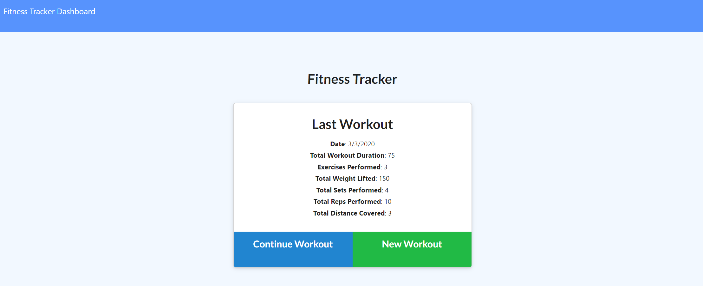
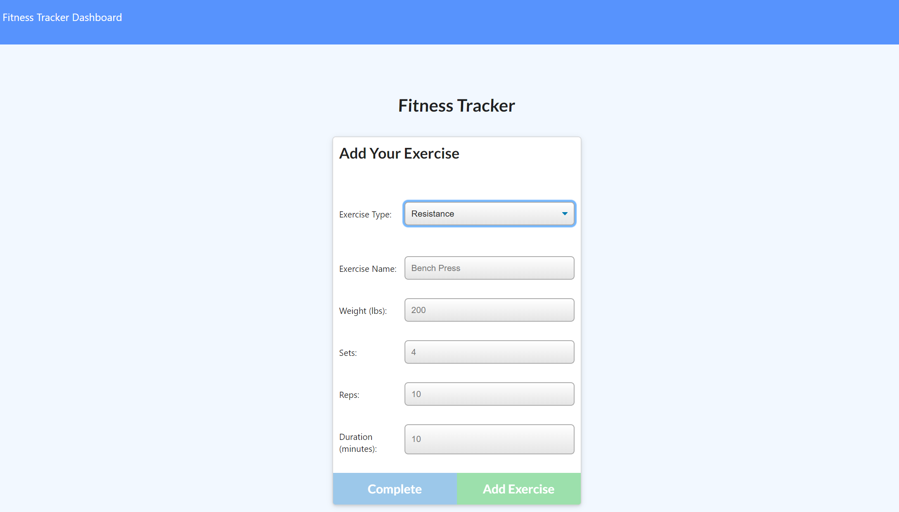
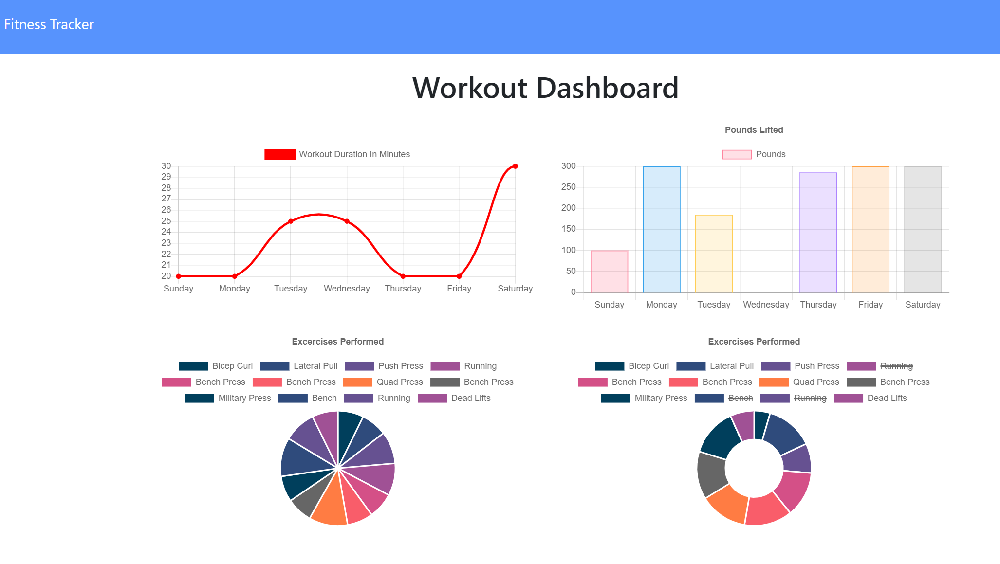

# Workout-tracker

## Description
This app charts workouts done by a user.  They are able to "add" a workout for resistance or cardio on both the "Continue Workout" and the "Add Workout" buttons (Don't know why that is, it was a code givien to me for a homework assignment).  The "Last Workout" page will tally the amount of time, reps, and other info about pertaining to the inputed workout.  The dashboard charts the workouts in 2 graphs.

## Deployment
Check out the deployed site on: https://floating-stream-68864.herokuapp.com/

For local deployment:
-Clone repo onto your machine.

-Run `npm install`.

-Run `npm run seed` to insert data.

-Run `npm start` or `node server.js` to run app.

-Open web browser to localhost:3000

-Click `Continue Exercise` or `Add Exercise` to add workout.

-Click `Continue` or `Add` to render data to add to "Last Workout" page.

-Data will render on the graphs automatically.

## Built with
-HTML

-CSS

-Javascript

-MongoDB

-Node

-NPM

-Heroku

-mLab

-Robo 3T

## Packages used

-MongooseDB

-Express

-Morgan

-Path

## Images of Deployed App

MIT License

Copyright (c) 2020 Elizabeth Garcia-Quilinquin

Permission is hereby granted, free of charge, to any person obtaining a copy
of this software and associated documentation files (the "Software"), to deal
in the Software without restriction, including without limitation the rights
to use, copy, modify, merge, publish, distribute, sublicense, and/or sell
copies of the Software, and to permit persons to whom the Software is
furnished to do so, subject to the following conditions:

The above copyright notice and this permission notice shall be included in all
copies or substantial portions of the Software.

THE SOFTWARE IS PROVIDED "AS IS", WITHOUT WARRANTY OF ANY KIND, EXPRESS OR
IMPLIED, INCLUDING BUT NOT LIMITED TO THE WARRANTIES OF MERCHANTABILITY,
FITNESS FOR A PARTICULAR PURPOSE AND NONINFRINGEMENT. IN NO EVENT SHALL THE
AUTHORS OR COPYRIGHT HOLDERS BE LIABLE FOR ANY CLAIM, DAMAGES OR OTHER
LIABILITY, WHETHER IN AN ACTION OF CONTRACT, TORT OR OTHERWISE, ARISING FROM,
OUT OF OR IN CONNECTION WITH THE SOFTWARE OR THE USE OR OTHER DEALINGS IN THE
SOFTWARE.
